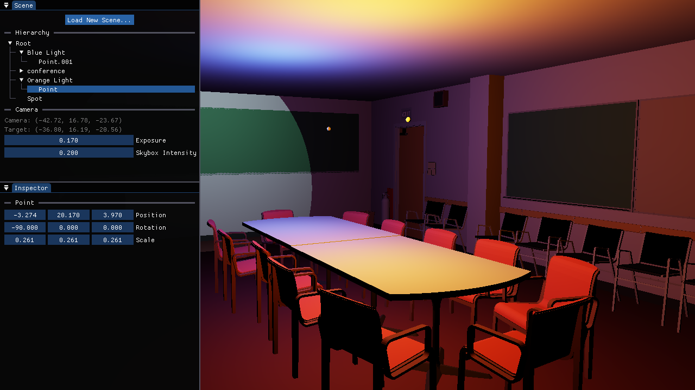
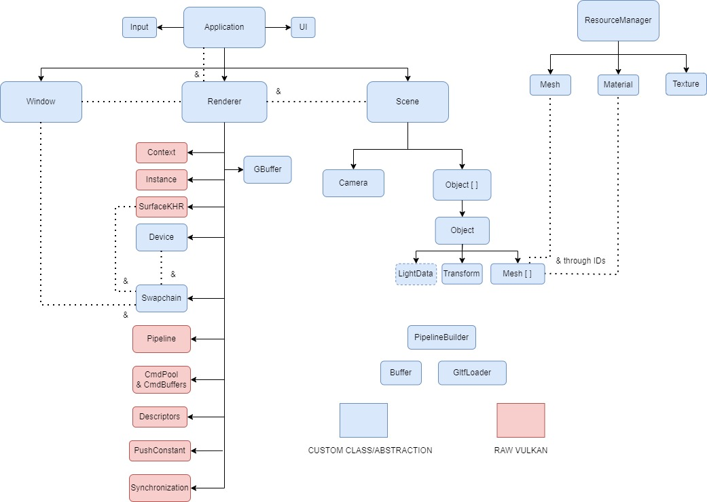

# Felina



Felina is a 3D renderer, i.e. a piece of software which takes a scene description as input and produces pretty visuals as output.
It is written in C++ and based on the Vulkan graphics API.

This is a learning projects which I'm still updating, as such, some parts of it are pretty rough and not polished as I'd like them to be. 
Right now, I'm prioritizing adding new features each time, and in doing so, I try to avoid bikeshedding as much as possible 
(i.e. if I could take a shortcut, I will). From time to time, I revisit parts of the codebase to refactor and improve its structure and readability.

While the primary goal of this project is understanding and practicing real-time rendering techniques, 
I also use it as a platform to refine my software engineering skills.

*I'm currently working on adding shadow mapping and exploring the possibility of migrating the current descriptor system to the new VK_EXT_descriptor_heap.*

# Features
- simple user interface
- full deferred rendering pipeline
- PBR material system
- texture support
- glTF scene loading
- skybox (with on the fly conversion from equirectangular to cubemap)
- multiple punctual lights support
# Roadmap
## Short term
- shadow mapping
- migration to VK_EXT_descriptor_heap
- normal mapping
- improve UX
- improve portability
## Long term
- DDGI-based global illumination

# Getting Started
## Prerequisites
- CMake 4.0 or higher
- C++20
- Vulkan 1.4+ SDK
## Dependencies
- [GLFW 3.4](https://www.glfw.org/)
- [GLM 1.0.1](https://github.com/g-truc/glm)
- [Vulkan Memory Allocator 3.3.0](https://github.com/GPUOpen-LibrariesAndSDKs/VulkanMemoryAllocator)
- [Dear ImGui 1.92.4 (docking)](https://github.com/ocornut/imgui)
- [tinygltf 2.9.7](https://github.com/syoyo/tinygltf)
- [tinyfd 3.21.2](https://sourceforge.net/projects/tinyfiledialogs)
## Build instructions
### Windows
1. Clone this repository:
```bash
git clone https://github.com/Frol3z/Felina.git
cd Felina
```
2. Create and enter the build directory:
```bash
mkdir build
cd build
```
3. Generate project files using CMake:
```bash
cmake ..
```
4. Open the generated **solution** inside the build folder.
5. Set `Felina` as the **startup project** in Visual Studio.
6. Build and run the project.

# Architecture


## GBuffer structure
| Attachment # | R              | G              | B               | A      |
| ------------ | -------------- | -------------- | --------------- | ------ |
| 0            | BaseColor.R    | BaseColor.G    | BaseColor.B     | Unused |
| 2            | Roughness      | Metalness      | Ambient Coeff.  | Unused |
| 3            | Normal.X       | Normal.Y       | Normal.Z        | Unused |
| 4            | Depth          | Depth          | Depth           | Depth  |

## Descriptor sets
### Geometry Pass
| Descriptor Set Layout | Binding | Set | VS  | FS  |
| :-------------------- | :-----: | :-: | :-: | :-: |
| Camera                |    0    |  0  |  Y  |  N  |
| Objects               |    0    |  1  |  Y  |  N  |
| Materials             |    0    |  2  |  N  |  Y  |
| Samplers              |    0    |  3  |  N  |  Y  |
| Textures              |    1    |  3  |  N  |  Y  |
| Skybox                |    2    |  3  |  N  |  Y  |

| Push Constants | VS  | FS  |
| -------------- | --- | --- |
| Objects        | Y   | N   |

### Lighting Pass
| Descriptor Set Layout |        Binding         | Set | VS  | FS  |
| :-------------------- | :--------------------: | :-: | :-: | :-: |
| Camera                |           0            |  0  |  N  |  Y  |
| Lights                |           0            |  1  |  N  |  Y  |
| GBuffer               | See attachment # above |  2  |  N  |  Y  |
| Samplers              |			0			 |  3  |  N  |  Y  |
| Textures              |			1			 |  3  |  N  |  Y  |
| Skybox                |			2			 |  3  |  N  |  Y  |

# References

## General
https://docs.vulkan.org/tutorial/latest/00_Introduction.html
https://registry.khronos.org/vulkan/specs/latest/html/vkspec.html
https://www.learncpp.com/
https://www.realtimerendering.com/
https://docs.vulkan.org/guide/latest/hlsl.html

## On specific topics
https://developer.nvidia.com/vulkan-memory-management
https://wallisc.github.io/rendering/2021/04/18/Fullscreen-Pass.html
https://learnopengl.com/PBR/IBL/Diffuse-irradiance
